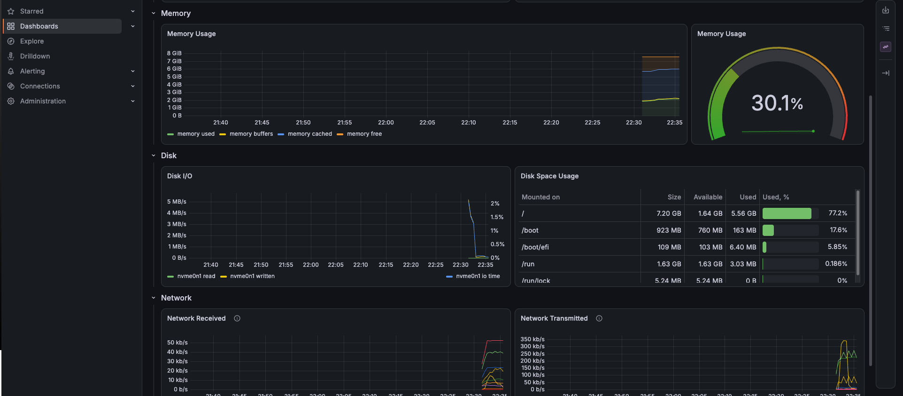
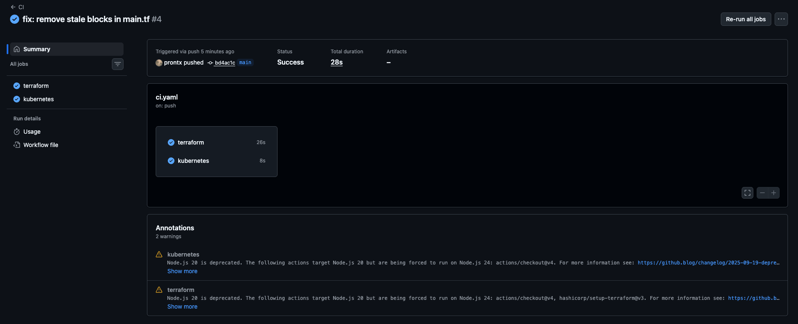

# Cloud-Native lab

Leveraging my 4+ years of OpenStack/RHOSP
production support engineering experience to cloud-native SRE practice. Everything here is
built from scratch, provisioned as code, and destroyed after each session.

## Contents

### `terraform/aws/` — Infrastructure as Code on AWS ✅
- VPC, subnet, routing (IGW, route tables) assembled explicitly — the AWS
  equivalent of what Neutron's `router-gateway-set` does implicitly
- EC2 provisioning with SSH keypair management and AMI lookup via data sources
  (no hardcoded, region-rotting AMI IDs)
- Fully machine-independent config: source IP and SSH public key supplied as
  variables — validates on any machine, including CI
- k3s single-node Kubernetes bootstrapped at boot via cloud-init `user_data`,
  with the public IP injected into the API cert SANs via IMDSv2 at boot,
  and kubelet pinned to the VPC resolver (see DNS incident below)
- State hygiene: tfstate excluded from VCS, provider versions pinned via lock file

### `scripts/` — session automation ✅
- `session-up.sh`: apply -> wait for SSH -> wait for cloud-init -> pull kubeconfig -> ready
- `session-down.sh`: destroy -> verify no instances/volumes/EIPs left behind

### `k8s/` — Kubernetes ops ✅
- Remote kubectl access (TLS SAN problem — see below)
- Observability: kube-prometheus-stack (Prometheus, Grafana, node-exporter,
  kube-state-metrics) with values override
- GitOps: Flux bootstrapped against this repo, monitoring stack deployed as a
  HelmRelease — cluster config converges from `k8s/clusters/lab/` on every
  push; manual kubectl changes are drift and get reverted

### `.github/workflows/` — CI ✅
- terraform fmt/validate on every push and PR — no cloud credentials in CI
  (`init -backend=false`)
- kubeconform schema validation of all Flux/K8s manifests

### `python-tools/` — Python beyond snippets ✅
- `healthpoller/`: polls a set of HTTP endpoints on an interval, tracks
  consecutive failures per endpoint, reports state transitions
  (healthy <-> down) — a threshold-based approach to avoid flapping alerts
  on single blips. Tests mock the HTTP boundary (`responses` library) —
  no real network calls in CI.
- `logmetrics/`: parses access-log lines into RED-style metrics
  (rate, errors, duration incl. p50/p99) per route, emits Prometheus
  text-exposition format. Parsing/aggregation kept pure (no I/O) —
  tests need no mocking at all, deliberate contrast with healthpoller.

## Incidents & lessons so far

Real problems hit and diagnosed along the way:

- **"TLS handshake timeout" on localhost kubectl** -> not a TLS problem.
  Diagnosed via `free -m` / `dmesg` / `top` as memory starvation: k3s control
  plane on a 1GB t3.micro left 29MB available. Symptoms lie about their layer.
  Fixed by right-sizing to t3.small.
- **Same signature, round two**: deploying kube-prometheus-stack starved the
  2GB node the same way — recognized it on sight this time. Empirical sizing
  rule derived: bare k3s needs 2GB, k3s + a real workload needs 4GB+.
- **Cluster-wide DNS SERVFAIL** -> Flux couldn't clone, `nslookup` from a pod
  returned SERVFAIL from CoreDNS. Root cause: CoreDNS inherited the host's
  `/etc/resolv.conf` pointing at systemd-resolved's loopback stub
  (127.0.0.53) — unreachable from inside a pod's network namespace, since
  every netns has its own loopback. Hotfixed by forwarding CoreDNS to the AWS
  VPC resolver (169.254.169.253); fixed permanently by pinning the kubelet to
  a dedicated resolv.conf in cloud-init. Also a lesson in stale status:
  the GitRepository kept showing the old error until its next reconcile.
- **First CI run failed on "working" code** — twice, instructively.
  `fmt -check` (exit 3) caught five weeks of hand-editing drift; then
  `validate` caught `file("~/.ssh/...")` — config that only worked on the
  machine where that file exists. Code that applies cleanly and code that
  passes a quality gate on a fresh machine are different standards. Fixed by
  making the key a variable; CI runs with zero cloud credentials.
- **Free-tier constraint discovery**: t3.medium rejected as not free-tier
  eligible. Read the error, ran `describe-instance-types
  --filters free-tier-eligible=true`, found m7i-flex.large (8GB) in the
  allowed list — better than the original plan.
- **Instance stop/start ≠ recreate**: resizing stops/starts the instance;
  cloud-init doesn't rerun but the public IP changes, leaving the boot-time
  TLS cert stale. Anything configured at boot goes stale when runtime identity
  changes. Fix: destroy and recreate.
- **Flux bootstrap 403 on deploy keys**: fine-grained GitHub token had
  Contents+Metadata but not Administration — Flux pushed manifests fine, then
  failed registering its SSH deploy key. Least-privilege tokens fail closed;
  granting one more verb is the system working.
- **Drift detection in practice**: manually tagged a VPC in the console,
  watched `terraform plan` propose reverting it. Later re-learned it from the
  other side: deleted the Grafana deployment by hand, watched Flux heal it.
- **State is the boundary of Terraform's world**: tagged the wrong (default)
  VPC, Terraform didn't blink. Resources outside state are invisible.

## Background

The mental model transfer from OpenStack is the point of this repo:

| OpenStack        | AWS / cloud-native          |
|------------------|-----------------------------|
| Neutron network  | VPC                         |
| router-gateway   | Internet Gateway + routes   |
| Floating IP      | Elastic IP / auto-assign    |
| Heat             | Terraform / CloudFormation  |
| Heat parameters  | Terraform variables         |
| Glance image     | AMI (per-region!)           |
| Keystone 403     | IAM deny-by-default         |
| config-drive / metadata API | IMDSv2           |

## TODO
- [ ] Least-privilege IAM policy for the terraform user (lab currently uses AdministratorAccess)
- [ ] Remote state backend (S3 + DynamoDB locking)
- [ ] flux bootstrap folded into session-up.sh (token via env var)
- [ ] pre-commit hook mirroring the CI checks locally
- [ ] Loki + log pipeline
- [ ] Multi-node k3s
- [ ] Terraform mirror against OpenStack provider